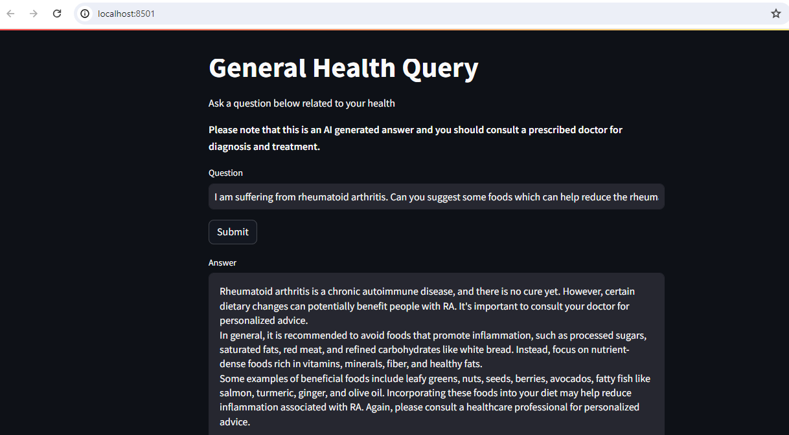

# health-query-app-llama2

This is a general health query application using medllama2 which is built on langchain. It does the followings: 

1. Users enters a health realted query
2. Users clicks submit button 
3. The application returns the answer

# Install

pip install -r requirements.txt

# Run ollama server

Before running the code, run the following:

ollama run(medllama2)

# Run the code

streamlit run health_query.py

# Output

